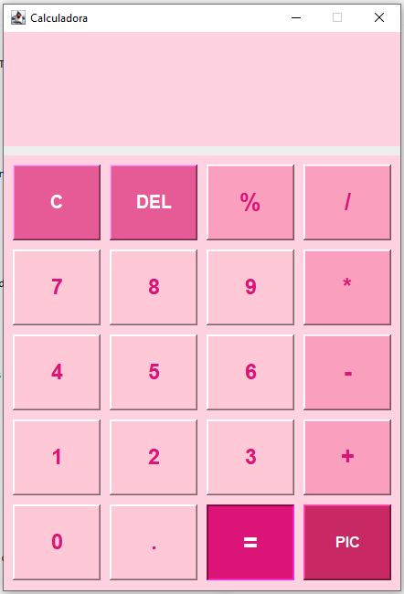

# Calculadora Java Swing
Calculadora de escritorio desarrollada en Java utilizando Swing, con soporte para teclado y mouse, interfaz gráfica personalizada y empaquetada como aplicación ejecutable para Windows.

---

## ✨ Características

| Función | Disponible |
|----------|----------|
| Suma | ✅ |
| Resta | ✅ |
| Multiplicación | ✅ |
| División | ✅ |
| Módulo (%) | ✅ |
| Entrada por teclado | ✅ |
| Entrada por mouse | ✅ |
| Botón PIC con imagen personalizada | ✅ |
| Ejecutable Windows (.exe) | ✅ |
| Instalador Inno Setup | ✅ |

---

## 📸 Vista previa


---

## ⌨️ Controles de teclado

| Tecla | Acción |
|--------|--------|
| 0-9 | Ingresar números |
| . | Punto decimal |
| + - * / | Operaciones |
| Enter | Calcular resultado |
| = | Calcular resultado |
| Backspace | Borrar último carácter |
| Esc | Limpiar pantalla |
| C | Limpiar pantalla |

---

## Instalación

1. Descargar la última versión desde la sección **Releases**.
2. Ejecutar el instalador.
3. Abrir la aplicación desde el acceso directo creado.

---

## Compilación

### Compilar

```bash
javac -encoding UTF-8 CALCULADORA.java
```

### Crear JAR

```bash
jar cfe Calculadora.jar CALCULADORA *.class
```

### Ejecutar JAR

```bash
java -jar Calculadora.jar
```

---

## 🛠️ Tecnologías utilizadas

- Java
- Java Swing
- AWT
- Launch4j
- Inno Setup

---

## 📁 Estructura del proyecto

```text
Calculadora/
│
├── CALCULADORA.java
├── 1780320118114.jpg
├── calculadora.ico
├── Calculadora.jar
├── Script_CREACION.iss
├── README.md
└── .gitignore
```

---

## 👤 Autor

**Matías Deiriz**

---

## 📄 Licencia

Proyecto de uso educativo y personal.

---

⭐ Si te gustó el proyecto, considerá darle una estrella al repositorio.
